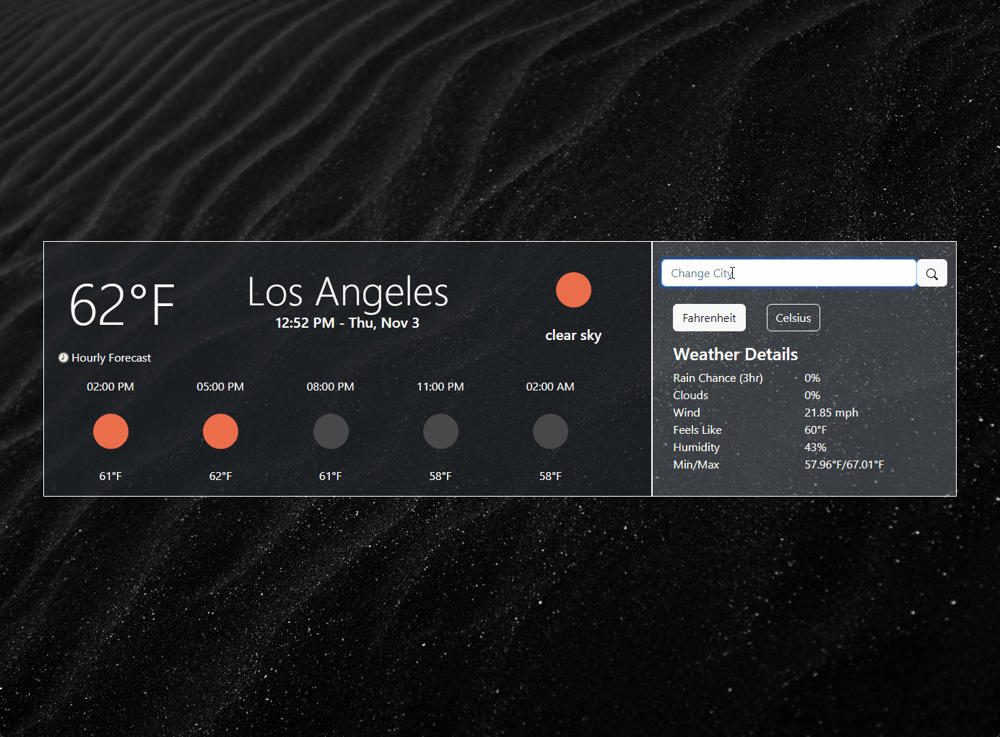

# Weather-app

A weather application that uses data from OpenWeather's Weather API.

**[LIVE LINK HERE!](https://c-yip.github.io/weather-app/)**

- Search by city for current weather and hourly forecast.
- Switch between metric and imperial units.
- Gain details of city's weather, including chance of rain and humidity.
- Mobile compatibility.

Future features:

- Improved mobile compatibility.
- User location as default location.
- Switch between daily forecast and hourly forecast.
- Dark and lights mode toggle.

Background photo by Adrien Olichon: https://www.pexels.com/photo/black-sand-dunes-2387793/
